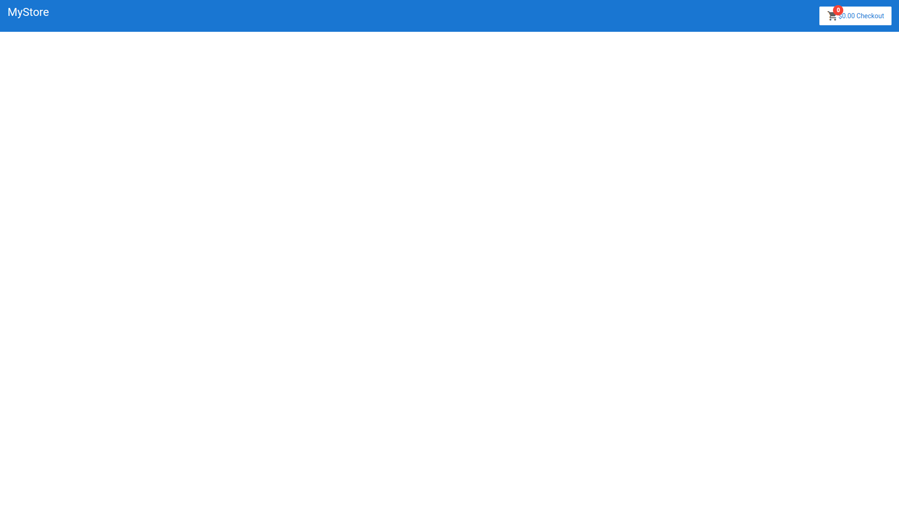
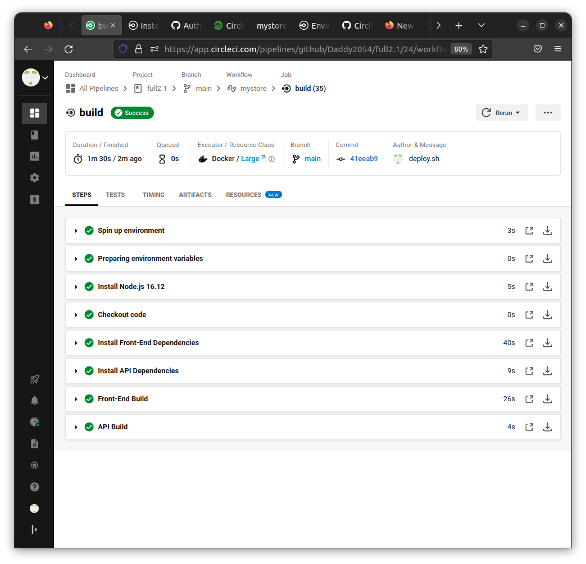
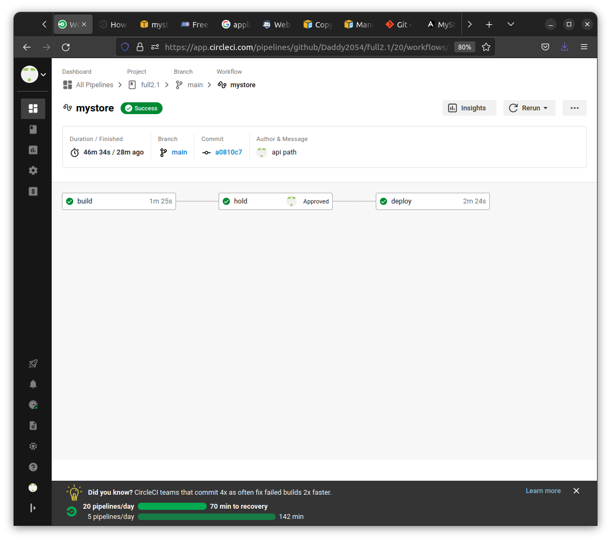
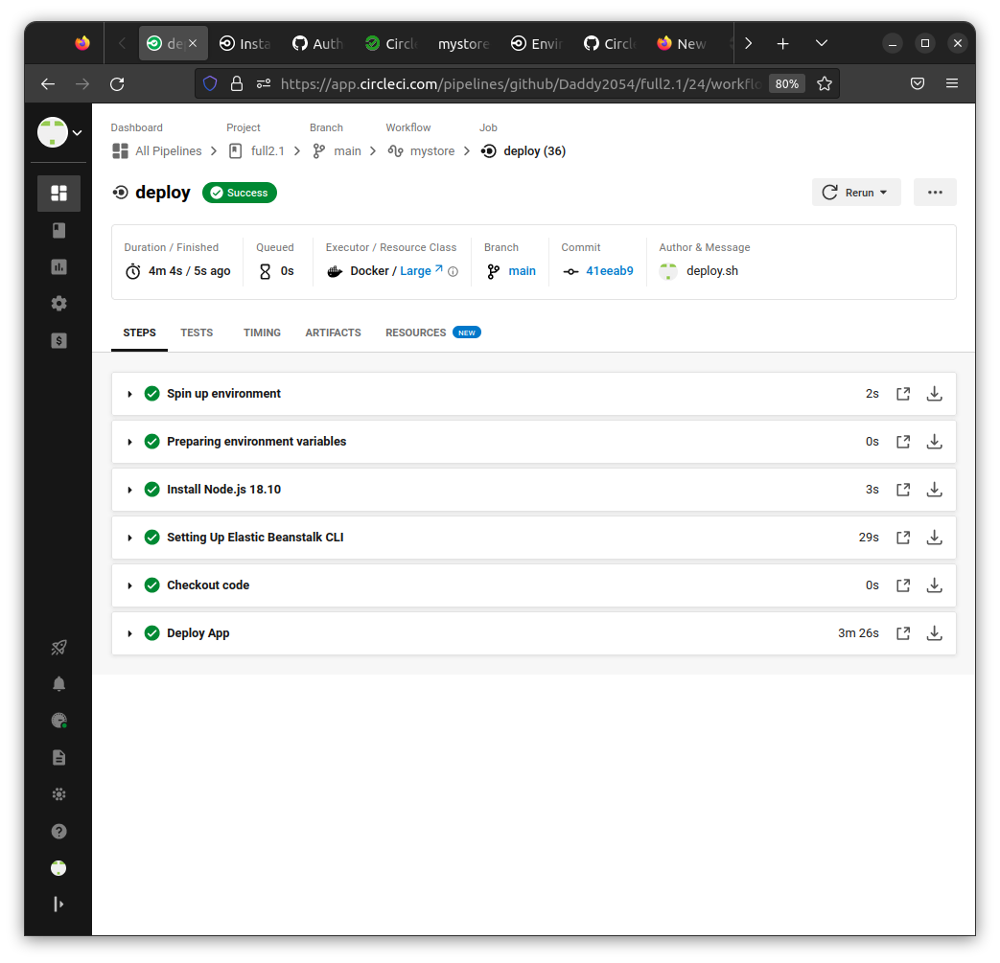
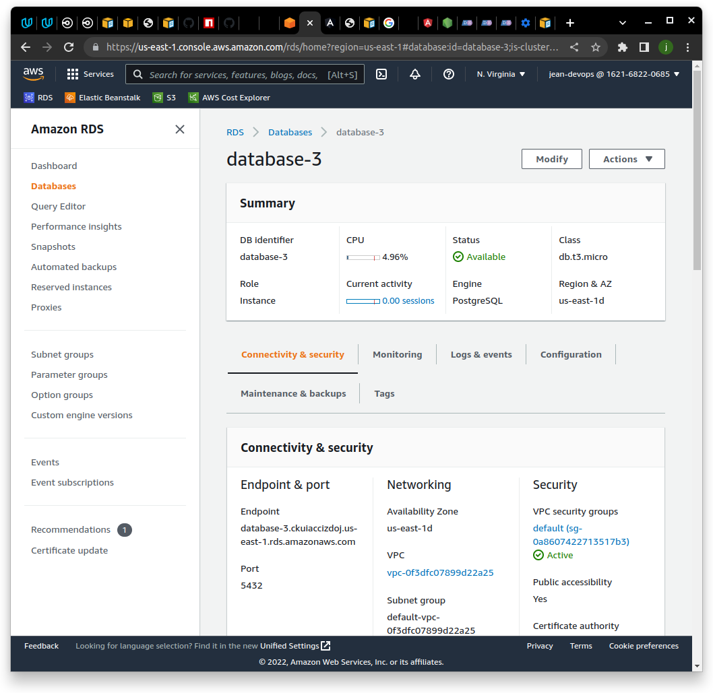
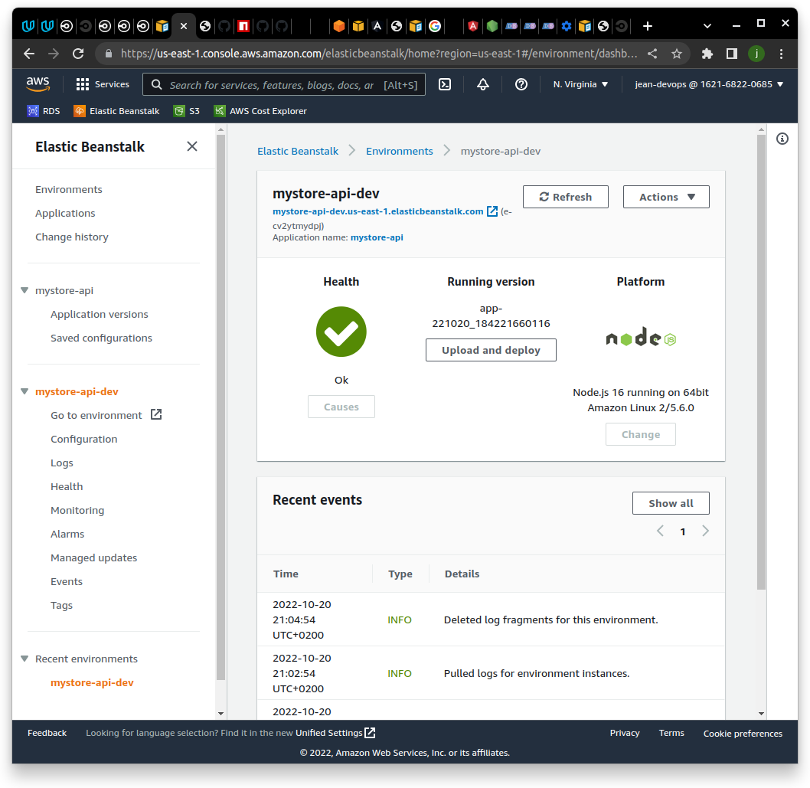
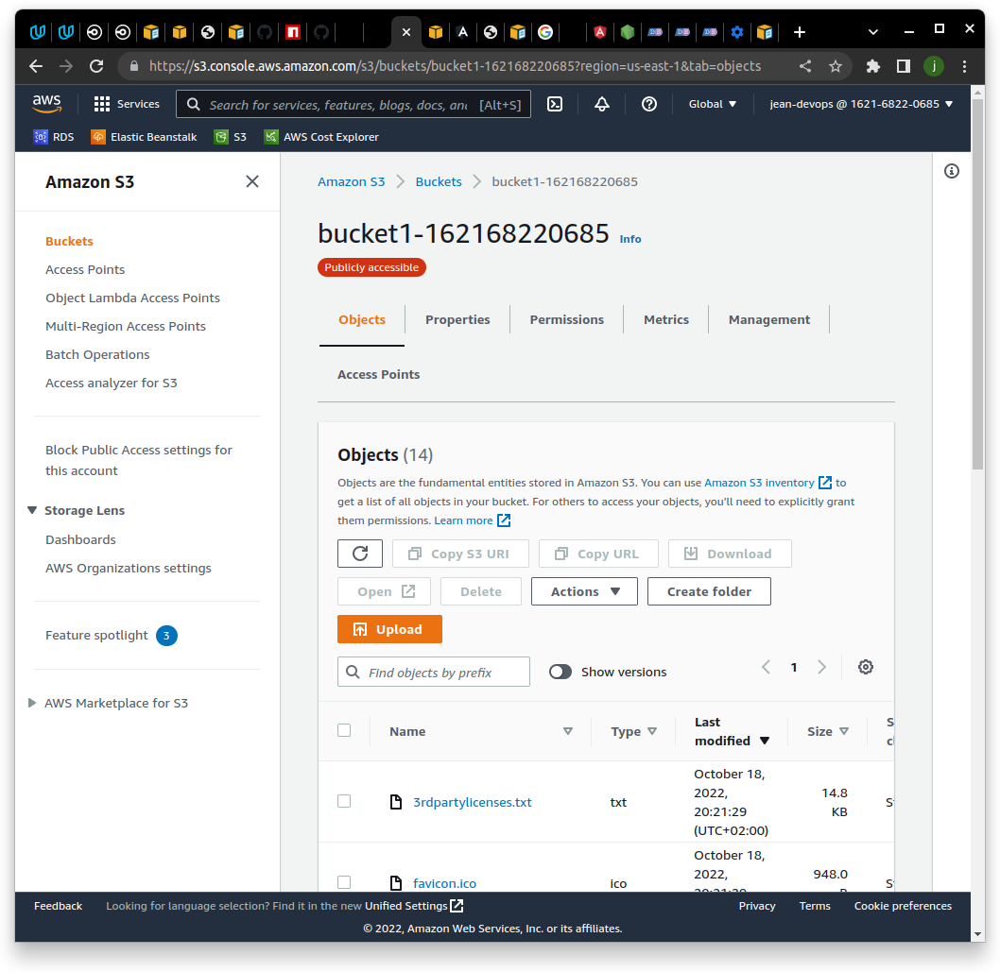

# MyStore [](https://dl.circleci.com/status-badge/redirect/gh/Daddy2054/full2.1/tree/main)

Udacity Nanodegree: Full Stack Javascript Developer
course: Hosting a Full-Stack Application 
student:daddy2054

## Project Architecture

This three part project consist of frontend SPA, API-server and DB instance.
Everythinhg in ready to CI/CD pipeline for deploying in AWS cloud.


[Application Infrasructure](docs/Infrastructure_description.md)

[Application dependencies](docs/Application_dependencies.md)

[Pipelene overview](docs/Pipeline_description.md)

Live applicaton: http://bucket1-162168220685.s3-website-us-east-1.amazonaws.com/

 
 





## How to Deploy
The project's tree do not include submodules. two main parts are in the main repo.

1. Fork repository https://github.com/Daddy2054/full2.1.git
2. connect it via "Set up Project" in CircleCI
3. in "Project Settings/Environment variables" insert your secrets:
```
AWS_ACCESS_KEY_ID
AWS_DEFAULT_REGION	
AWS_SECRET_ACCESS_KEY
NG_DEPLOY_AWS_BUCKET	# a S3 bucket with web hosting config
NG_DEPLOY_AWS_REGION	# same as AWS_DEFAULT_REGION	
API_URL # URL of elastic beanstalk environment with API server like http://myenv-api-dev.us-east-1.elasticbeanstalk.com/

```
4. Create a PostgreSQL instance in AWS RDS service (very expensive!!!), with pgAdmin/psql execute 
```
CREATE DATABASE full_stack;
``` 
5. Create an Elastic Beanstalk environment with the name _mystore-api-dev_. this name also noted in "mystore/mystore-api/.elasticbeanstalk/config.yml".
6. Go to this ElasticBeanstalk environment. In Configuration,Software, insert environment variables:
```
ENV = dev # don't change this
POSTGRES_DB # must be already created in DB instance, like "postgres"
POSTGRES_HOST # DB endpoint, like database-3.ckuijdyizdoj.us-east-1.rds.amazonaws.com
POSTGRES_USER # DB instance user
POSTGRES_PASSWORD # DB instance password
POSTGRES_PORT # DB instance port, like 5432

```

6. start build on "main" branch
7. if install and build are ok , press "approve" to deploy in AWS Cloud.
8. if You got all green, then go to S3 bucket page to see the frontend app.


