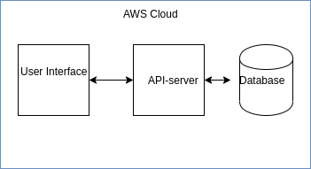

# Application Infrastructure



Full application is initial skeleton of e-shop with basic functionality of creating initial products list,browsing product list,add to cart and checkout.

User interface is one part, another part is API server which connects to database.

All is configured to be:
1. Continuosly rebuilding on every commit to GitHub, using CircleCI pipeline.
2. Continuosly deployed on AWS Cloud, using S3 bucket with Web Hosting for frontend and Elastic Beanstalk for API-server. Database technology is PostgreSQL instance on RDS service.

For local development PostgreSQL instance in Docker container will work. Just change these variables in your environment:
```
API_URL # URL of elastic beanstalk environment with API server like http://myenv-api-dev.us-east-1.elasticbeanstalk.com/

ENV = dev # don't change this
POSTGRES_DB # must be already created in DB instance, like "postgres"
POSTGRES_HOST # DB endpoint, like database-3.ckuijdyizdoj.us-east-1.rds.amazonaws.com
POSTGRES_USER # DB instance user
POSTGRES_PASSWORD # DB instance password
POSTGRES_PORT # DB instance port, like 5432
```