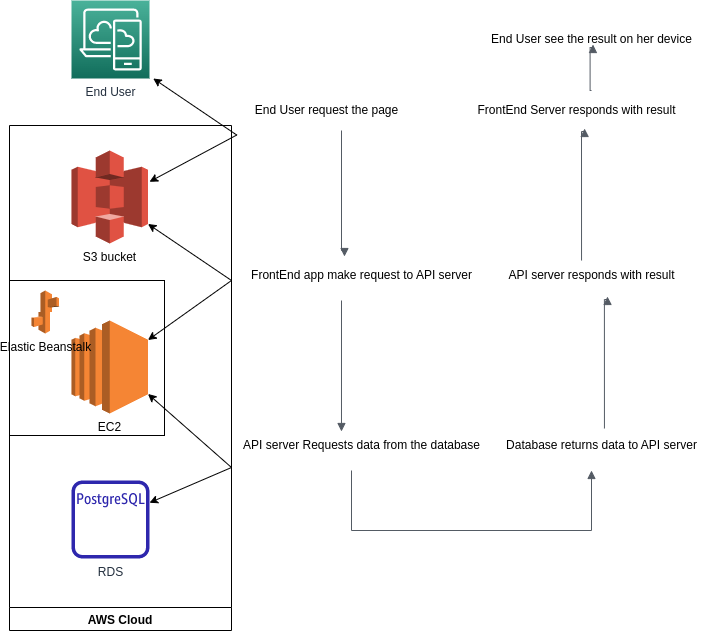

# Application Infrastructure

Full application is initial skeleton of e-shop with basic functionality of creating initial products list,browsing product list,add to cart and checkout.

User interface is one part, another part is API server which connects to database.

