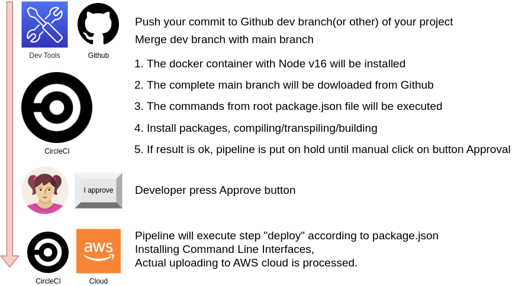

# Pipeline Process



Config file _.circleci/config.yml_ explain how pipeline in working.

1. Push your commit to Github dev branch of your project

2. Merge dev branch with main branch

3. This will activate CircleCi pipeline process

4. The docker container with Node v16 will be installed

5. The complete main branch will be dowloaded from Github

6. The commands from root package.json file will be executed

7. Install packages, compiling/transpiling/building

8. If result is ok, pipeline is put on hold until manual click on button Approval

9. Only when approved, pipeline will execute step "deploy" according to package.json

10. in this step, after installing Command Line Interfaces, actual uploading to AWS cloud is processed.

## How to replicate
The project's tree do not include submodules. two main parts are in the main repo.

1. Clone repository https://github.com/Daddy2054/full2.1.git

2. Connect it via "Set up Project" in CircleCI

3. Create a PostgreSQL instance in AWS RDS service (very expensive!!!), 

4. Change Connectivity & security/Security/VPC security groups/Security group default/Inbound rules/source to 0.0.0.0/0

5. with pgAdmin/psql connect to this postgres box and execute query
```
CREATE DATABASE full_stack;
``` 
6. Create an Elastic Beanstalk environment with the name _mystore-api-dev_(or something, which also noted in "mystore/mystore-api/.elasticbeanstalk/config.yml"). 

7. Create S3 bucket, publicly accessible, with web hosting

8. in CircleCI "Project Settings/Environment variables" ([see here an example](docs/vars.md)) insert your secrets and paths:
```
AWS_ACCESS_KEY_ID
AWS_DEFAULT_REGION	
AWS_SECRET_ACCESS_KEY
NG_DEPLOY_AWS_BUCKET	# a S3 bucket with web hosting config
NG_DEPLOY_AWS_REGION	# same as AWS_DEFAULT_REGION	
API_URL # URL of elastic beanstalk environment with API server like http://myenv-api-dev.us-east-1.elasticbeanstalk.com/
ENV = dev # don't change this
POSTGRES_DB # must be already created in DB instance, like "postgres"
POSTGRES_HOST # DB endpoint, like database-3.ckuijdyizdoj.us-east-1.rds.amazonaws.com
POSTGRES_USER # DB instance user
POSTGRES_PASSWORD # DB instance password
POSTGRES_PORT # DB instance port, like 5432

```

9. start build on "main" branch

10. if install and build are ok , press "approve" to deploy in AWS Cloud.

11. if You got all green, then go to S3 bucket page to see the frontend app.

